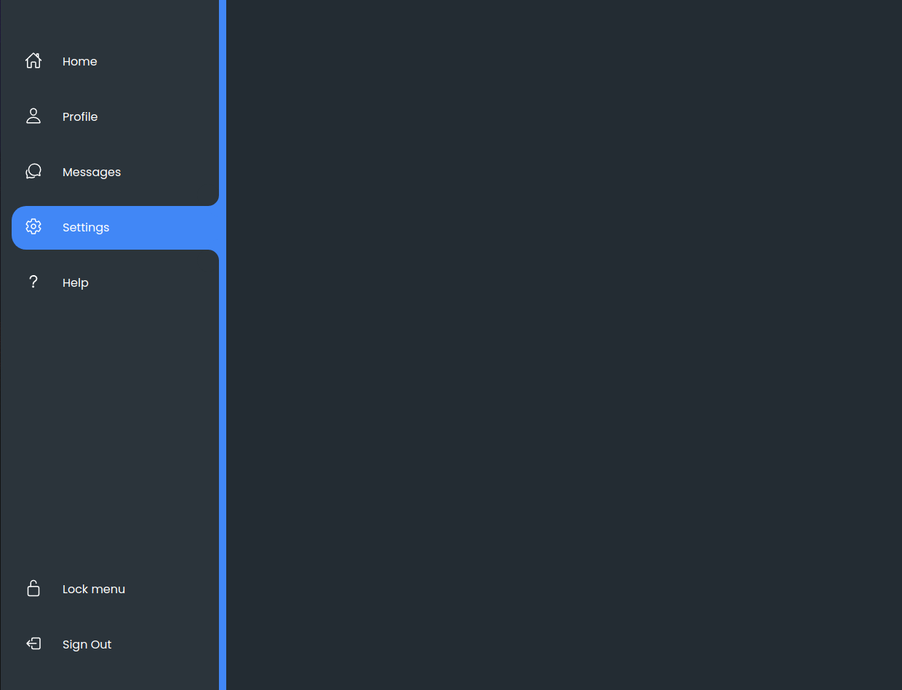
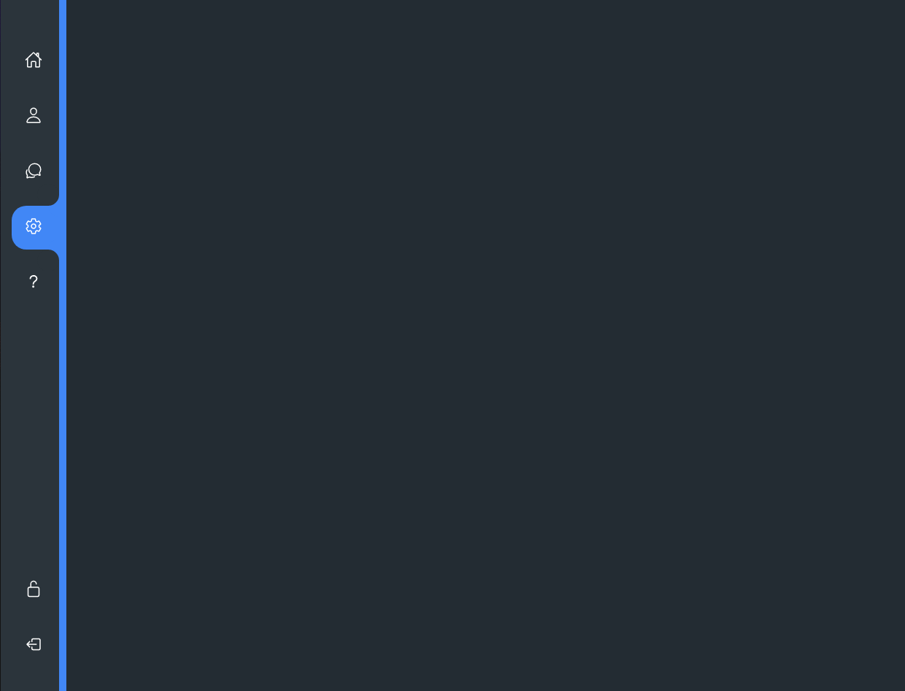
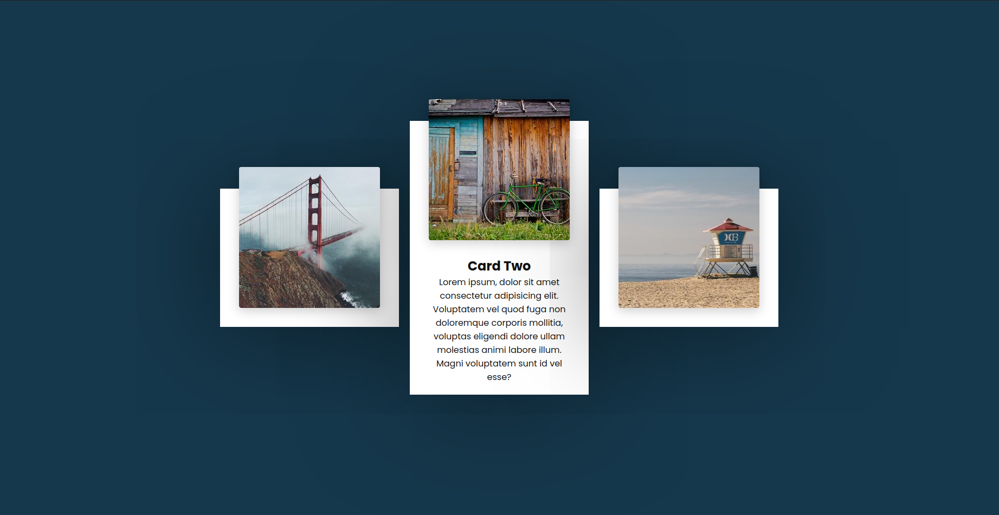
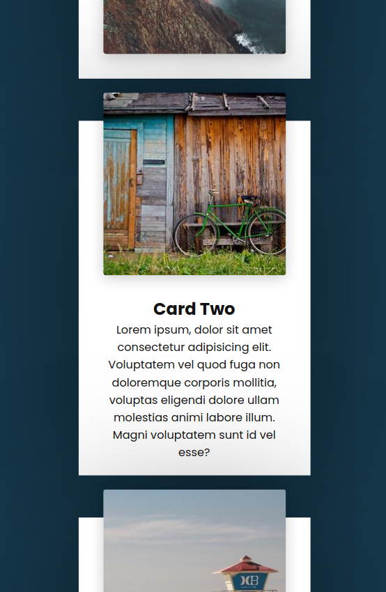
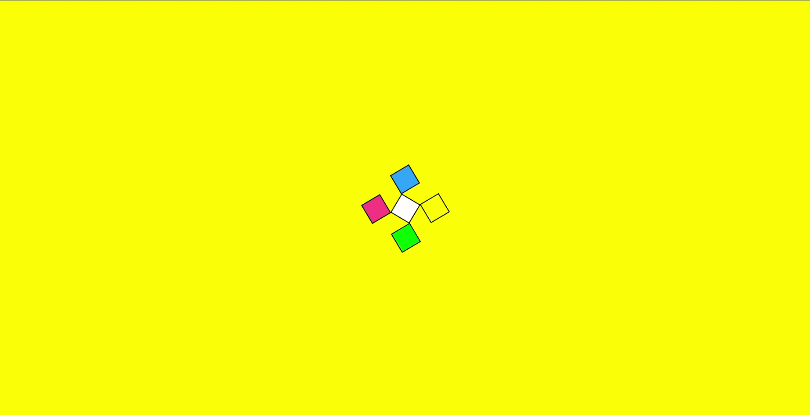
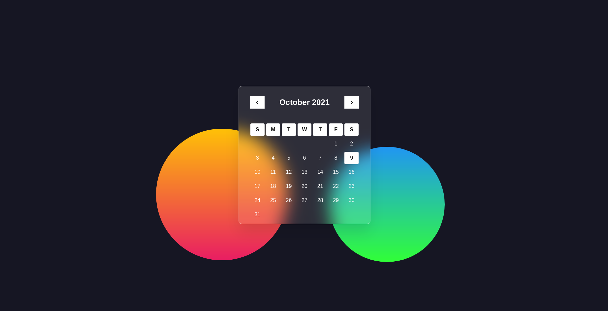
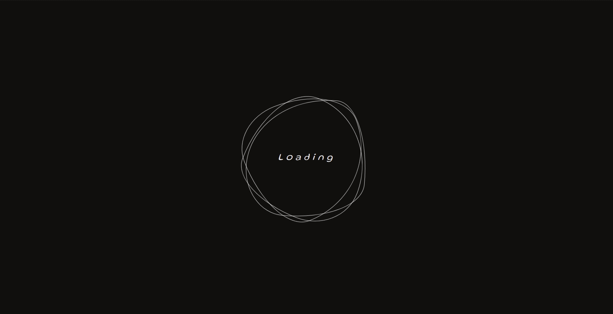

# Custom web components
Some random web components created by following tutorials or freestyle coding :D

#### [Sidenav](https://helix-0.web.app/demo/custom-web-components/nav-menu)

    
    

#### Responsive hover cards

    

#### ["Rotating squares" loading animation](https://helix-0.web.app/demo/custom-web-components/rotating-squares-loading)

#### [Glassmorphism Calendar](https://helix-0.web.app/demo/custom-web-components/glassmorphism-calendar)

#### [Neon Loading Spinner](https://helix-0.web.app/demo/custom-web-components/neon-loading-spinner)

#### [Loading Animation](https://helix-0.web.app/demo/custom-web-components/loading-animation)

#### Water Drops - SCSS Drawing
